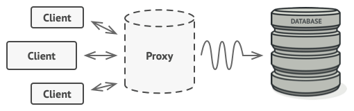

# Structural Design Patterns
Structural patterns explain how to assemble objects and classes into larger structures while keeping these structures flexible and efficient.

## Adapter
1. Theory can be understood https://refactoring.guru/design-patterns/adapter
2. We have two programs to understand adapter in the `adapter/` folder.

### Iprocess
We have an `Iprocess` interface which is implementing `process()` function. The `Adapter` class(struct) is to be made of type `Iprocess` so it implements the `process()` function. The `Adapter` class has an attribute of type `Adaptee` which has a method called `convert()`, called inside of the process method.
```
fmt.Println(processor.adaptee.adapterType)
```
This would give an error because processor is of type `Iprocess` interface and this inteface doesn't have `adaptee` attribute. 
```
fmt.Println(Adapter{}.adaptee.adapterType)
```
This would give `0` as expected because `adaptee` is an attribute of `Adapter` class.

### Lightning port
We have a `computer` interface which is implementing `insertIntoLightningPort()` function. Our purpose is to insert USB by client from mac or windows. For mac we can directly invoke the interface function but for windows we need to convert the lightning singal to USB and then insert it into the computer. For this reason client uses the `insertLightningConnectorIntoComputer()` function for type `Computer`. To run this execute the command
```
go run .
```

## Bridge
1. Bridge is a structural design pattern that divides business logic or huge class into separate class hierarchies that can be developed independently. To understand more https://refactoring.guru/design-patterns/bridge.
2. Moreover Birdge consists of two terms `abstraction` and `implementation` as part of its definition.
    * a. `Abstraction` is the high level layer which the client connects to. This layer is not supposed to do any work on its own rather this layer supasses the work to the `implementation` layer.
    * b. `Implementation` is the actual place where the process or the required action is performed.
3. Best example to understand this is the Azure cloud API management. The API management is responsible to handle various clients or requests coming from Azure CLI or Azure portal. This makes the API management an `abstraction` layer and the inner process or inner APIs as the `implementation` layer.
4. In the below picture 
    * a. The Abstraction provides high-level control logic. It relies on the implementation object to do the actual low-level work.
    * b. The Implementation declares the interface that’s common for all concrete implementations. An abstraction can only communicate with an implementation object via methods that are declared here. The abstraction may list the same methods as the implementation, but usually the abstraction declares some complex behaviors that rely on a wide variety of primitive operations declared by the implementation. 
    * c. Concrete Implementations contain platform-specific code.
    * d. Refined Abstractions provide variants of control logic. Like their parent, they work with different implementations via the general implementation interface.
    * e. Usually, the Client is only interested in working with the abstraction. However, it’s the client’s job to link the abstraction object with one of the implementation objects
    

### Printer
In this printer we are trying to implement both the printer `hp` and `epson` from different OS like `mac` and `windows`. For this their respective files are created. Our purpose it to make client not worried about connecting different computer to different printers.

## Composite
Composite is a structural design pattern that lets you compose objects into tree structures and then work with these structures as if they were individual objects. https://refactoring.guru/design-patterns/composite

### Files and folders
Let’s try to understand the Composite pattern with an example of an operating system’s file system. In the file system, there are two types of objects: files and folders. There are cases when files and folders should be treated to be the same way. This is where the Composite pattern comes in handy.

Imagine that you need to run a search for a particular keyword in your file system. This search operation applies to both files and folders. For a file, it will just look into the contents of the file; for a folder, it will go through all files of that folder to find that keyword.

## Decorators
Decorator is a structural design pattern that lets you attach new behaviors to objects by placing these objects inside special wrapper objects that contain the behaviors.
You create a similar interface for different behaviours which work independently and attach these behaviours to the object to increase its functionatlity. More theory can be reached here https://refactoring.guru/design-patterns/decorator

## Facade
Facade is a structural design pattern that provides a simplified interface to a library, a framework, or any other complex set of classes. Theory can be reached here https://refactoring.guru/design-patterns/facade.
A facade is a class that provides a simple interface to a complex subsystem which contains lots of moving parts. A facade might provide limited functionality in comparison to working with the subsystem directly. However, it includes only those features that clients really care about. This is similar to the python package that we have built over database, datastore and messagequeue class. Having a facade is handy when you need to integrate your app with a sophisticated library that has dozens of features, but you just need a tiny bit of its functionality.

### wallet
It’s easy to underestimate the complexities that happen behind the scenes when you order a pizza using your credit card. There are dozens of subsystems that are acting in this process. Here’s just a shortlist of them:

1. Check account
2. Check security PIN
3. Credit/debit balance
4. Make ledger entry
5. Send notification
In a complex system like this, it’s easy to get lost and easy to break stuff if you’re doing something wrong. That’s why there’s a concept of the Facade pattern: a thing that lets the client work with dozens of components using a simple interface. The client only needs to enter the card details, the security pin, the amount to pay, and the operation type. The Facade directs further communications with various components without exposing the client to internal complexities.

## Flyweight
Flyweight is a structural design pattern that lets you fit more objects into the available amount of RAM by sharing common parts of state between multiple objects instead of keeping all of the data in each object. The Flyweight pattern suggests that you stop storing the extrinsic state inside the object. Instead, you should pass this state to specific methods which rely on it. Only the intrinsic state stays within the object, letting you reuse it in different contexts. As a result, you’d need fewer of these objects since they only differ in the intrinsic state, which has much fewer variations than the extrinsic. Theory is available here at https://refactoring.guru/design-patterns/flyweight.

### Counter Strike
In counter strike there are two kind of players called terrorists and counter-terrorists. There are dress-codes for terrorists and counter-terrorists.
Let's suppose there are 5 player of each type which will lead to total of 10 different types of dress objects. Instead of this we can create only two objects for each type of dress.
The Flyweight pattern takes out the common parts and creates flyweight objects. These flyweight objects (dress) can then be shared among multiple objects (player). This drastically reduces the number of dress objects, and the good part is that even if you create more players, only two dress objects will be sufficient.


## Proxy
Proxy is a structural design pattern that lets you provide a substitute or placeholder for another object. A proxy controls access to the original object, allowing you to perform something either before or after the request gets through to the original object. To understand this let us assume we want to perform some process based on client's request. For this client creates an object and this object is passed to our class which implements the actual process in background. When this happens the object from client is copied to all the places inside the implemented class. To stop this we introduce a proxy in between these two so that client's object can offload the work to proxy which creates a copy of the client object and performs the work. Moreover if we want to perform any additional activity over this client object then we can perform it in the proxy without chaning the actual background process.
 

### nginx
Proxy is a structural design pattern that provides an object that acts as a substitute for a real service object used by a client. A proxy receives client requests, does some work (access control, caching, etc.) and then passes the request to a service object.


## Private class data
The private class data is used to secure the data in a class. This pattern encapsulated the initialization of the class data.

### customer name bank example
In this example we are trying to protect the details of the account. The only details that we are trying to give is the customer name. For this we use an interface to hide the complexity of the details in a different struct and then try to set the properties of this struct using the methods of the `account` type.
Try running `go run privateclass.go` you will observe the following details
```
Private class hidden {}
Account Customer Name John Smith
Account id 4532
Account Type current
```
The output `Private class hidden {}` shows that when we try to marshal the details of account it is kept hidden.